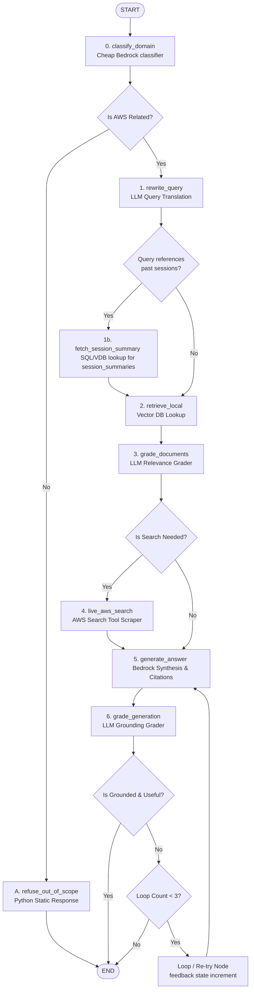

# LangGraph Agent Architecture

This document describes the state design, nodes, routing, and workflow of the Agentic Chatbot for AWS Documentation.

---

## 1. Flowchart & State Transitions

Below is the state execution path and routing logic for the Agentic RAG pipeline:



---

## 2. State Definition (`AgentState`)

```python
from typing import Annotated, Sequence, TypedDict
from langchain_core.messages import BaseMessage
from langgraph.graph.message import add_messages

class AgentState(TypedDict):
    # Holds conversation history and intermediate agent responses
    messages: Annotated[Sequence[BaseMessage], add_messages]
    
    # The search-optimized version of the user's latest query
    standalone_query: str
    
    # Context chunks retrieved from Local RAG or Live Search
    documents: list[dict]  # dict contains: content, source_url, title
    
    # The final generated response text
    generation: str
    
    # Internal routing flags
    search_needed: bool
    is_aws_related: bool
    
    # Guard against infinite loops
    loop_count: int
```

---

## 3. Node Definitions

### Node 0: `classify_domain`
* **Input:** Latest message in `messages`.
* **Logic:** Employs Claude 3 Haiku via Bedrock to determine if the user query requests information related to AWS services, pricing, architectures, or concepts.
* **Output:** Sets `is_aws_related` (bool).

### Node A: `refuse_out_of_scope` (Python Node)
* **Input:** None.
* **Logic:** Sets a static refusal response directly to `generation`. Bypasses all LLM synthesis nodes.
* **Output:** Updates `generation` with: *"I'm sorry, I am an AI assistant dedicated to helping with AWS Documentation..."*

### Node 1: `rewrite_query`
* **Input:** `messages`.
* **Logic:** Claude 3 Haiku synthesizes the user query and chat history into a standalone lookup phrase optimized for vector search.
* **Output:** Sets `standalone_query`.

### Node 1b: `fetch_session_summary`
* **Input:** `standalone_query`.
* **Logic:** Relational/Vector lookup query against the database `session_summaries` table to pull context on past closed sessions.
* **Output:** Injects past session summaries into the context stream.

### Node 2: `retrieve_local`
* **Input:** `standalone_query`.
* **Logic:** Queries RDS PostgreSQL vector columns using cosine similarity matching Titan Text Embeddings.
* **Output:** Fills `documents` state list.

### Node 3: `grade_documents`
* **Input:** `standalone_query`, `documents`.
* **Logic:** Fast LLM evaluation checking if the text chunks are relevant.
* **Output:** Updates `documents` with relevant chunks, and sets `search_needed = True` if the filtered list is empty.

### Node 4: `live_aws_search`
* **Input:** `standalone_query`.
* **Logic:** Triggers web search constrained to `docs.aws.amazon.com`, pulls text content from top URLs, chunks them, and appends them to state.
* **Output:** Appends results to `documents`.

### Node 5: `generate_answer`
* **Input:** `documents`, `messages`.
* **Logic:** Claude 3.5 Sonnet synthesizes context and history to formulate the final markdown response with inline citations (URLs).
* **Output:** Sets `generation`.

### Node 6: `grade_generation`
* **Input:** `generation`, `documents`.
* **Logic:** Hallucination grading (is the response supported by the retrieved documents?) and Relevance grading (does it address the original user request?).
* **Output:** Dynamic routing decision.

---

## 4. LangGraph Agent Implementation Checklist

Use this checklist to implement the agentic backend application from scratch:

### Phase 1: Project Setup & Environment Boilerplate
- [ ] Initialize Python virtual environment and add dependencies to `requirements.txt` (FastAPI, uvicorn, langgraph, langchain-aws, pydantic-settings, psycopg2-binary, pyyaml).
- [ ] Create `.env` file specifying database connections, search API keys (Tavily/Google), and AWS Bedrock credentials.
- [ ] Implement `backend/app/config.py` using `pydantic-settings` to load and validate environment variables.
- [ ] Write the skeleton for `backend/app/main.py` configuring FastAPI, enabling CORS, and setting up lifecycle loaders.

### Phase 2: Agent State & System Prompts
- [ ] Create `backend/app/agents/state.py` containing the `AgentState` schema.
- [ ] Create `backend/app/agents/prompts.py` defining system instructions for:
  - [ ] **Domain Classifier:** Strictly output JSON formatting: `{"is_aws_related": true/false}`.
  - [ ] **Query Rewriter:** Parse conversational turns into a single standalone search query.
  - [ ] **Document Grader:** Grade chunks as "yes" or "no" based on query relevance.
  - [ ] **Answer Generator:** Require strict inline URL citations mapped from document metadata.
  - [ ] **Grounding Grader:** Binary check verifying if LLM generation statements are anchored to the context.

### Phase 3: Implementing Graph Nodes
- [ ] **Domain Classifier:** Implement `backend/app/agents/nodes/classify.py` invoking Claude 3 Haiku via `ChatBedrock` matching the classifier prompt.
- [ ] **Refusal Worker (Python-Only):** Implement `backend/app/agents/nodes/refuse.py` writing the static out-of-scope block to state.
- [ ] **Query Rewriter:** Implement `backend/app/agents/nodes/rewrite.py` to rewrite history.
- [ ] **Local Retriever:** Implement `backend/app/agents/nodes/retrieve.py` fetching vector matches from `document_chunks` table.
- [ ] **Doc Relevance Grader:** Implement `backend/app/agents/nodes/grade.py` to filter documents and dynamically set `search_needed = True`.
- [ ] **Live AWS Search Tool:** Implement `backend/app/agents/nodes/search.py` using a web search client restricted to `site:docs.aws.amazon.com`.
- [ ] **Answer Synthesizer:** Implement `backend/app/agents/nodes/generate.py` using Claude 3.5 Sonnet to construct the final response.
- [ ] **Hallucination Grader:** Add the verification node inside `grade.py` comparing final answer to chunk contents.

### Phase 4: Graph Compilation & Routing
- [ ] Write `backend/app/agents/graph.py`:
  - [ ] Initialize `StateGraph(AgentState)`.
  - [ ] Add all nodes using `graph.add_node()`.
  - [ ] Define entrypoint `graph.set_entry_point("classify_domain")`.
  - [ ] Add conditional routing edges:
    - [ ] `add_conditional_edges("classify_domain", route_domain)` to route to `rewrite_query` or `refuse_out_of_scope`.
    - [ ] `add_conditional_edges("grade_documents", route_search)` to route to `live_aws_search` or `generate_answer`.
    - [ ] `add_conditional_edges("grade_generation", route_grounding)` to route to `END` or loop back for regeneration.
  - [ ] Compile the graph using a checkpointer: `graph.compile(checkpointer=MemorySaver())`.

### Phase 5: FastAPI Router & Tests
- [ ] Write `backend/app/routers/chat.py`:
  - [ ] Mount `/chat` endpoint parsing incoming prompts and session-ids (`thread_id`).
  - [ ] Invoke compiled graph using `graph.ainvoke({"messages": [HumanMessage(content=prompt)]}, {"configurable": {"thread_id": thread_id}})` and return state.
- [ ] Write local unit tests in `backend/tests/` to mock Bedrock API calls and assert correct node routing execution.

### Phase 6: App Runner Infrastructure (Terraform)
- [ ] Implement `terraform/apprunner.tf`:
  - [ ] Define the `aws_apprunner_service` resource.
  - [ ] Configure it to deploy the Docker container built from the FastAPI source.
  - [ ] Declare the `aws_apprunner_vpc_connector` mapping it to the private subnet IDs to allow secure RDS access.
  - [ ] Author custom IAM roles granting Bedrock invoke model permissions and CloudWatch logging.
