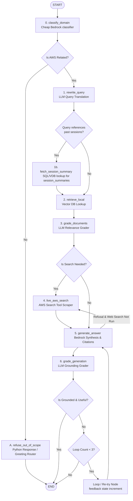

# LangGraph Agent Architecture

This document describes the state design, nodes, routing, and workflow of the Agentic Chatbot for AWS Documentation.

---

## 1. Flowchart & State Transitions

Below is the state execution path and routing logic for the Agentic RAG pipeline:



---

## 2. State Definition (`AgentState`)

```python
from typing import Annotated, Sequence, TypedDict
from langchain_core.messages import BaseMessage
from langgraph.graph.message import add_messages

class AgentState(TypedDict):
    # Holds conversation history and intermediate agent responses
    messages: Annotated[Sequence[BaseMessage], add_messages]
    
    # The search-optimized version of the user's latest query
    standalone_query: str
    
    # Context chunks retrieved from Local RAG or Live Search
    documents: list[dict]  # dict contains: content, source_url, title
    
    # The final generated response text
    generation: str
    
    # Internal routing flags
    search_needed: bool
    is_aws_related: bool
    classification: str
    web_search_run: bool
    
    # Guard against infinite loops
    loop_count: int
```

---

## 3. Node Definitions

### Node 0: `classify_domain`
* **Input:** Latest message in `messages`.
* **Logic:** Employs Claude 3 Haiku via Bedrock to classify the query intent into `"aws_related"`, `"session_history"`, `"conversational"`, or `"out_of_scope"`.
* **Output:** Sets `is_aws_related` (bool) and `classification` (str).

### Node A: `refuse_out_of_scope` (Python Node)
* **Input:** `classification`, `messages`.
* **Logic:** If `classification` is `"conversational"`, returns a friendly greeting or pleasantry. Otherwise, sets a static out-of-scope refusal response.
* **Output:** Updates `generation`.

### Node 1: `rewrite_query`
* **Input:** `messages`.
* **Logic:** Claude 3 Haiku synthesizes the user query and chat history into a standalone lookup phrase optimized for vector search.
* **Output:** Sets `standalone_query`.

### Node 1b: `fetch_session_summary`
* **Input:** `standalone_query`.
* **Logic:** Relational/Vector lookup query against the database `session_summaries` table to pull context on past closed sessions.
* **Output:** Injects past session summaries into the context stream.

### Node 2: `retrieve_local`
* **Input:** `standalone_query`.
* **Logic:** Queries RDS PostgreSQL vector columns using cosine similarity matching Titan Text Embeddings.
* **Output:** Fills `documents` state list.

### Node 3: `grade_documents`
* **Input:** `standalone_query`, `documents`.
* **Logic:** Fast LLM evaluation checking if the text chunks are relevant.
* **Output:** Updates `documents` with relevant chunks, and sets `search_needed = True` if the filtered list is empty.

### Node 4: `live_aws_search`
* **Input:** `standalone_query`.
* **Logic:** Triggers web search constrained to `docs.aws.amazon.com`, pulls text content from top URLs, chunks them, and appends them to state.
* **Output:** Appends results to `documents` and sets `web_search_run = True`.

### Node 5: `generate_answer`
* **Input:** `documents`, `messages`.
* **Logic:** Claude 3.5 Sonnet synthesizes context and history to formulate the final markdown response with inline citations (URLs).
* **Output:** Sets `generation`.

### Node 6: `grade_generation`
* **Input:** `generation`, `documents`, `web_search_run`.
* **Logic:** Checks for hallucination and relevance. If `generation` is a context refusal message and `web_search_run` is False, routes to `live_aws_search`.
* **Output:** Dynamic routing decision.

---